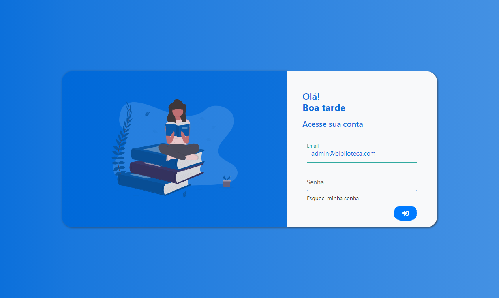
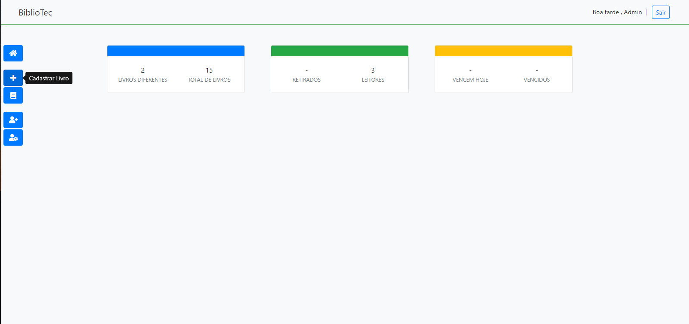
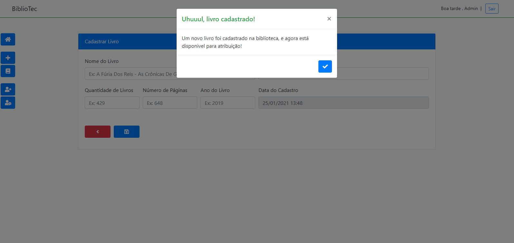
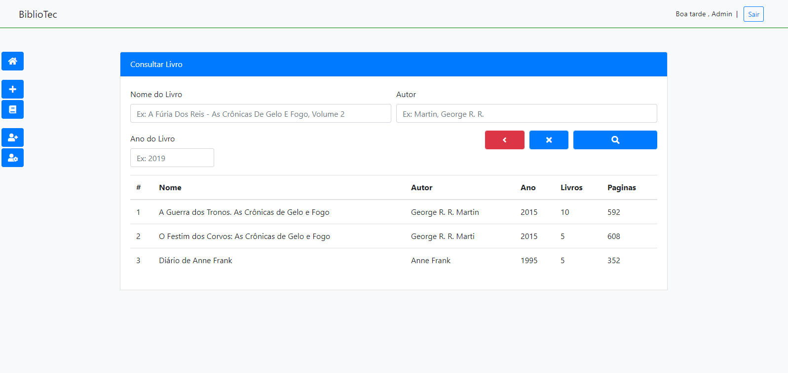
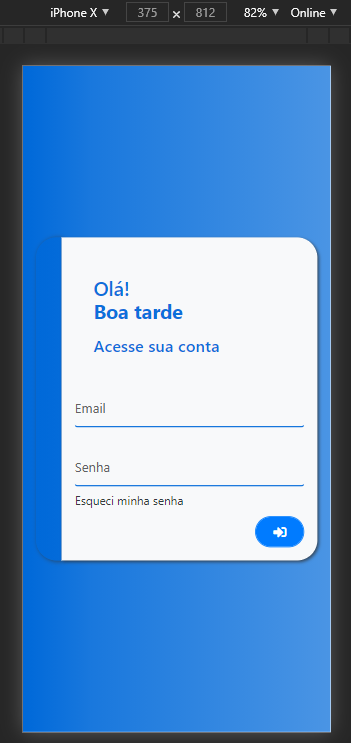

## Wirisson Souza
## Repositório para estudos de desenvolvimento Web.

<h3>HTML5, CSS3, Bootstrap, JavaScript, EcmaScript 2015</h3>
<h3>PHP, MYSQL</h3>

### Tabela de conteúdos
=================
<!--ts-->
   * [Calculadora JS](#calcjs)
   * [Sistema de Biblioteca](#sistema-biblioteca)
   <h4 align="center"> 
	🚧 Em construção...  🚧
</h4>
<!--te-->
<h3>Login Biblioteca</h3>
<h3 align="center">
  
</h3>

<h3>Dashboard Biblioteca</h3>
<h3 align="center">
  
</h3>

<h4 align="center"> 
	🚧 Em construção...  🚧
</h4>

<h3>Cadastro Livro</h3>
<h3 align="center">
  
</h3>

<h3>Consulta Livro</h3>
<h3 align="center">
  
</h3>

<h3>Login Mobile</h3>
<h3 align="center">
  
</h3>

<h4 align="center"> 
	🚧 Em construção...  🚧
</h4>
